#  Magic Adventure

A terminal RPG built in Go that blends classic text adventure mechanics with modern features. Play solo offline or join friends in shared party quests.

[](https://github.com/MaizerGomes/magicadvanture/releases)
[](https://github.com/MaizerGomes/magicadvanture/releases)
[](LICENSE)

---

## Features

### Core Gameplay
- **5 Character Slots** — Save progress in separate slots, perfect for trying different builds
- **Open World** — Explore 15+ unique locations: village, forest, river, harbor, lighthouse, tide caves, old ruins, moonwell, observatory, desert, arctic, sage hut, glitch zones, and more
- **Turn-Based Combat** — Strategic battles with health bars, damage calculation, and combat status effects
- **Progressive Leveling** — Earn XP, gold, and skill points to strengthen your hero

### Online & Multiplayer
- **Party Quests** — Team up with friends for Monster Hunt, Void Expedition, Frost Pact, and Sun Covenant
- **Dungeon Phases** — Multi-stage party dungeons with coordinated strikes
- **Chat & Social** — Room chat, whispers, party invites, and notifications
- **MongoDB Backend** — Optional online persistence when `MONGO_URI` is configured

### AI Assistant
- **Wise Man** — In-game AI helper with Gemini or Cloudflare integration
- **Contextual Guidance** — Get hints and lore without leaving the game

---

## Quick Install

```bash
# macOS / Linux
brew tap MaizerGomes/magicadvanture
brew install magicadventure
```

Or [download a binary](https://github.com/MaizerGomes/magicadvanture/releases) directly.

---

## Run It

```bash
# From source
go run .

# Or run the installed binary
magicadventure
```

First run creates `magicadventure.db` locally. Configure via environment or `.env` file.

---

## Configuration

| Variable | Description | Default |
|----------|-------------|---------|
| `MAGIC_ADVENTURE_DB_PATH` | Path to sqlite database | `./magicadventure.db` |
| `MONGO_URI` | MongoDB connection for online features | (offline mode) |
| `MONGO_DB_NAME` | Mongo database name | `magicadventure_online` |
| `WISEMAN_AI_PROVIDER` | AI provider: `gemini`, `cloudflare`, `legacy` | - |
| `WISEMAN_AI_KEY` | API key for the wise man | - |

Create a `.env` file in the project root:

```bash
MONGO_URI=mongodb://localhost:27017
WISEMAN_AI_PROVIDER=gemini
WISEMAN_AI_KEY=your-api-key-here
```

---

## Build from Source

```bash
# Clone and build
git clone https://github.com/MaizerGomes/magicadvanture.git
cd magicadvanture
go build -o magicadventure .

# Cross-compile
GOOS=darwin GOARCH=arm64 go build -o magicadventure-mac-arm .
GOOS=darwin GOARCH=amd64 go build -o magicadventure-mac-64 .
GOOS=linux GOARCH=amd64 go build -o magicadventure-linux64 .
GOOS=windows GOARCH=amd64 go build -o magicadventure.exe .
```

---

## Game Guide

### Progression
1. **Village** — Start your journey, visit the tavern and shops
2. **Forest** — Gather resources, fight initial enemies
3. **River & Harbor** — Access water-based content and trading
4. **Lighthouse & Tide Caves** —Mid-game challenges
5. **Moonwell & Observatory** — Magic and star lore
6. **Desert & Arctic** — End-game biomes with unique rewards
7. **Dragon's Peak** — Final boss encounter

### Side Quests
- **Triptych Blessing** — Collect the Ruins Token, Moon Charm, and Star Map
- **Sage Hut** — Turn in collected items for bonuses

### Tips
- Save often (the game auto-saves after each room)
- Party quests scale with group size
- Check the Settings menu to configure the wise man

---

## Contributing

Contributions welcome! Open an issue or submit a PR.

---

## License

MIT — See [LICENSE](LICENSE) for details.

---

<p align="center">
  <sub>Created by Dante Gomes with assistance from Gemini and Codex</sub>
</p>